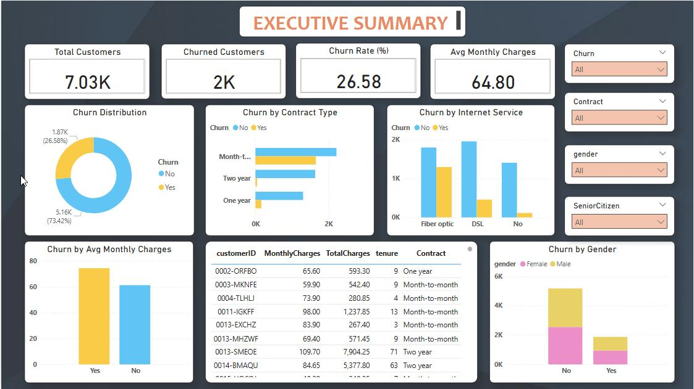
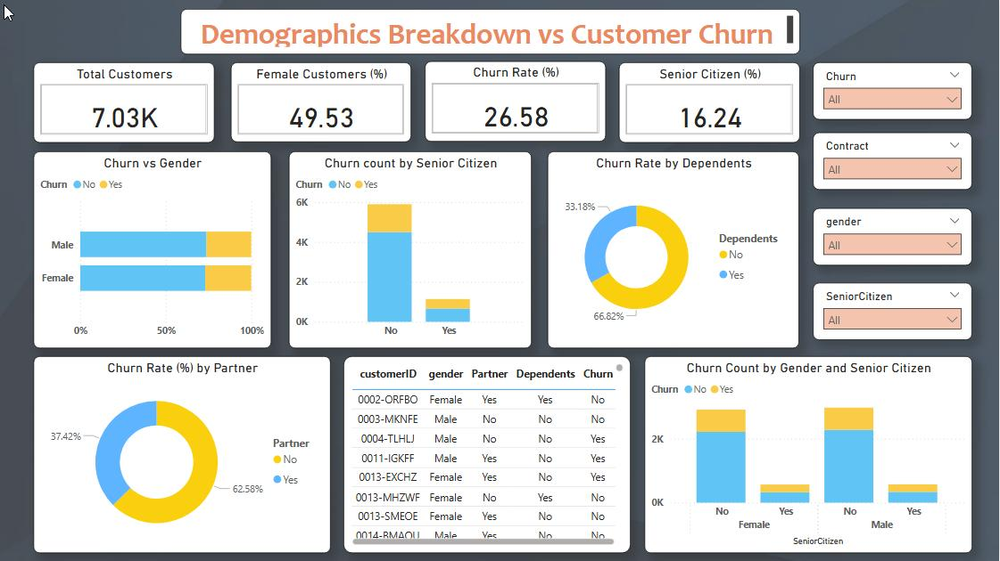
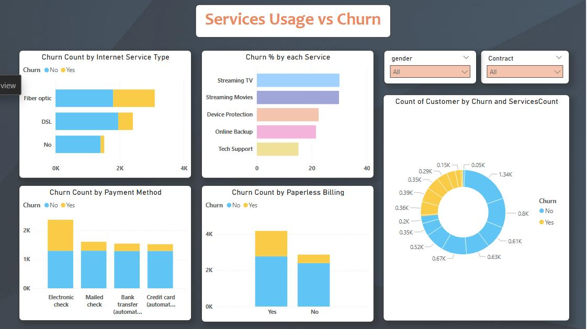

# 📊 Telecom Churn Analysis
This end-to-end project analyzes customer churn in the telecom industry using Python for EDA and Power BI for interactive dashboards. The objective is to uncover churn patterns and support strategic retention decisions.

---
## 🚀 Key Highlights
- **EDA using Python**: Handled missing values, data types, and performed univariate & bivariate analysis.
- **Feature Engineering**: Created `ServicesCount` and other derived insights.
- **Power BI Dashboard**:
  - Executive KPIs & trends
  - Churn by Demographics
  - Churn by Services
- **DAX Measures**: Used for % churn calculation by category.

---
## 📌 Tools & Technologies
- Python (pandas, seaborn, matplotlib)
- Google Colab / Jupyter
- Power BI Desktop
- DAX (Power BI formulas)

---

## 📁 Dashboard Preview
  **Page 1: Executive Summary Page**
  
  
  

  **Page 2: Demographics Breakdown vs Customer Churn**
  
  
  
  

  **Page 3: Services Usage vs Churn**
  
  

  ---
## 📎 Deliverables
- ✅ Cleaned CSV dataset  
- ✅ EDA notebook with visualizations  
- ✅ Interactive Power BI dashboard (PDF)  
- ✅ Detailed documentation in Word
  

---
## 📈 Insights
- Higher churn observed among customers with fewer added services.
- Tech Support, Online Backup, and Security services correlate with retention.
- Senior citizens and customers without partners/dependents are more likely to churn.
